# SenseNova-U1: Unifying Multimodal Understanding and Generation with NEO-Unify Architecture

<p align="center">
  <strong>English</strong> | <a href="./README_CN.md">简体中文</a>
</p>

<p align="center">
  <a href="#"></a>
  <a href="https://huggingface.co/collections/sensenova/sensenova-u1"></a>
  <a href="https://unify.light-ai.top/"></a>
  <a href="./LICENSE"></a>
  <a href="https://discord.gg/cxkwXWjp"></a>
</p>

<p align="center">
  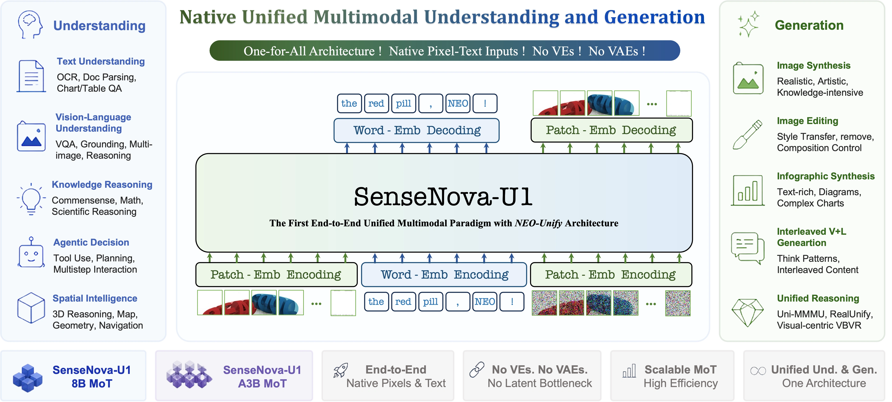
</p>

<p align="center">
  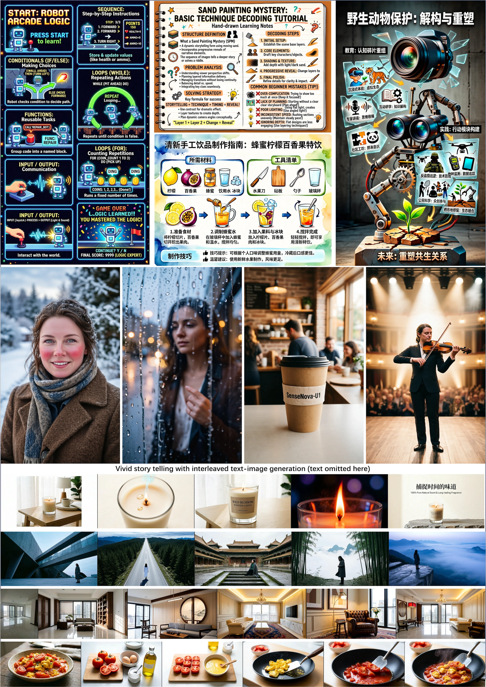
</p>

## 🌟 Overview

🚀 **SenseNova U1** is a new series of native multimodal models that unifies multimodal understanding, reasoning, and generation within a monolithic architecture. 
It marks a fundamental paradigm shift in multimodal AI: **from modality integration to true unification**. Rather than relying on adapters to translate between modalities, SenseNova U1 models think-and-act across language and vision natively.

The unification of visual understanding and generation opens tremendous possibilities. SenseNova U1 sits in the stage of **Data-driven Learning** (like ChatGPT), yet gestures toward the next stage, that is, **Agentic Learning** (like OpenClaw) and thinking in a natively multimodal way.

<p align="center">
  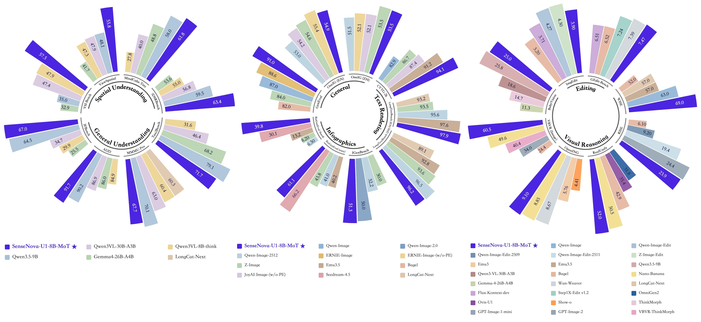
</p>

#### 🏗️ *Key Pillars:*      

At the core of SenseNova U1 is **[NEO-Unify](https://huggingface.co/blog/sensenova/neo-unify)**, a novel architecture designed from the first principles for multimodal AI:  *It eliminates both Visual Encoder (VE) and Variational Auto-Encoder (VAE) where pixel-word information are inherently and deeply correlated.* Several important features are as follows:

- 🔗 Model language and visual information end-to-end as a unified compound.   
- 🖼️ Preserve semantic richness while maintaining pixel-level visual fidelity.     
- 🧠 Reason across modalities with high efficiency & minimal conflict via native MoTs. 

#### ✨ *What This Unlocks:*

Powered by this new core architecture, SenseNova U1 delivers exceptional efficiency in multimodal learning:

<p align="center">
  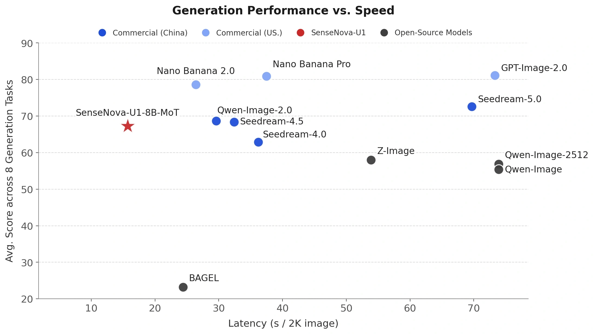
  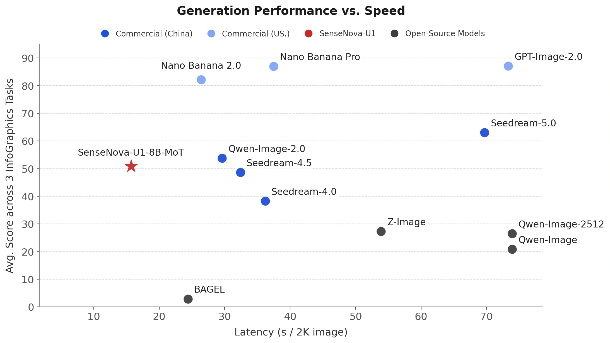
</p>

<p align="center">
  <sub>
    Left: Prediction Latency vs. Averaging Performance on OneIG (EN, ZH), LongText (EN, ZH), CVTG, BizGenEval (Easy, Hard), and IGenBench. <br>
    Right: Prediction Latency vs. Averaging Performance on Infographic Benchmarks (BizGenEval, IGenBench).
  </sub>
</p>

- 🏆 **Open-source SoTA in both understanding and generation**: SenseNova U1 sets a new standard for unified multimodal understanding and generation, achieving state-of-the-art performance among open-source models across a wide range of understanding, reasoning, and generation benchmarks.
  
- 📖 **Native interleaved image-text generation**: SenseNova U1 can generate coherent interleaved text and images in a single flow with one model, enabling use cases such as practical guides and travel diaries that combine clear communication with vivid storytelling and transform complex information into intuitive visuals.
  
- 📰 **High-density information rendering**: SenseNova U1 demonstrates strong capabilities in dense visual communication, generating richly structured layouts for knowledge illustrations, posters, presentations, comics, resumes, and other information-rich formats.


#### 🌍 *Beyond Multimodality:* 

- 🤖 Vision–Language–Action (VLA)
- 🌐 World Modeling (WM)

## 🦁 Models

In this release, we are open-sourcing the SenseNova U1 Lite series in two sizes:

- SenseNova U1-8B-MoT — dense backbone
- SenseNova U1-A3B-MoT — MoE backbone


| Model | Params | HF Weights |
| :---- | :------- | :--------- |
| SenseNova-U1-8B-MoT-SFT | 8B MoT | [🤗 link](https://huggingface.co/sensenova/SenseNova-U1-8B-MoT-SFT) |
| SenseNova-U1-8B-MoT | 8B MoT | [🤗 link](https://huggingface.co/sensenova/SenseNova-U1-8B-MoT) |
| SenseNova-U1-A3B-MoT-SFT | A3B MoT | 🤗 link |
| SenseNova-U1-A3B-MoT | A3B MoT | 🤗 link |

Here **SFT models** (*×32 downsampling ratio*) are trained via Understanding Warmup, Generation Pre-training, Unified Mid-training, and Unified SFT, with **final models** obtained after an initial round of T2I RL training.

Although relatively compact by today’s standards, these models already show strong performance across diverse tasks, comparable to commercial models with excellent cost efficiency. Notably, larger-scale versions are planned to further enhance capability and performance in the future.


## 📣 Updated News

- `[2026.04.27]` Initial release of the weights for [SenseNova-U1-8B-MoT-SFT](https://huggingface.co/sensenova/SenseNova-U1-8B-MoT-SFT) and [SenseNova-U1-8B-MoT](https://huggingface.co/sensenova/SenseNova-U1-8B-MoT).

- `[2026.04.27]` Initial release of the [inference code](https://github.com/OpenSenseNova/SenseNova-U1/blob/main/examples/README.md) for SenseNova-U1.   

## 📋 ToDo List

- [ ] Training code of SenseNova-U1 

- [ ] Final weights and technical report of SenseNova-U1


## 🎨 Showcases

<details>
<summary>🖼️ Text-to-Image (General)</summary>

| | | |
| :---: | :---: | :---: |
| [](./docs/assets/showcases/t2i_general/16_9_dense_face_hd_07.webp) | [](./docs/assets/showcases/t2i_general/16_9_dense_text_rendering_18.webp) | [](./docs/assets/showcases/t2i_general/16_9_dense_text_rendering_12.webp) |
| [](./docs/assets/showcases/t2i_general/1_1_face_hd_13.webp) | [](./docs/assets/showcases/t2i_general/1_1_face_hd_17.webp) | [](./docs/assets/showcases/t2i_general/1_1_dense_artistic_10.webp) |
| [](./docs/assets/showcases/t2i_general/1_1_landscape_06.webp) | [](./docs/assets/showcases/t2i_general/1_1_dense_landscape_12.webp) | [](./docs/assets/showcases/t2i_general/1_1_landscape_07.webp) |
| [](./docs/assets/showcases/t2i_general/9_16_dense_face_hd_10.webp) | [](./docs/assets/showcases/t2i_general/9_16_human_pose_11.webp) | [](./docs/assets/showcases/t2i_general/9_16_artistic_07.webp) |
| [](./docs/assets/showcases/t2i_general/9_16_sensenova_u1_31.webp) | [](./docs/assets/showcases/t2i_general/9_16_dense_landscape_05.webp) | [](./docs/assets/showcases/t2i_general/9_16_dense_artistic_11.webp) |

</details>

<details>
<summary>🖼️ Text-to-Image (Reasoning)</summary>

<table>
  <tr>
    <th style="width: 20%">Original Text</th>
    <th style="width: 50%">Reasoning Process</th>
    <th style="width: 30%">Resulting Image</th>
  </tr>
  <tr>
    <td style="vertical-align: top;">A male peacock trying to attract a female</td>
    <td><div style="max-height: 200px; overflow-y: auto;">1. <b>Instruction Understanding:</b> The core subject is a single male peacock. The action involves the male peacock trying to attract a female. 2. <b>Reasoning Process:</b> Male peacocks perform this ritual by fanning their tail feathers into a massive, colorful circular display. 3. <b>Establish the frame:</b> The frame captures the male peacock in a full-body shot to show the entire display. The angle is eye-level to emphasize the height of the tail feathers. 4. <b>Set the lighting and color:</b> Natural lighting illuminates the colorful circular display with soft shadows. The palette features vibrant blues and greens on the tail feathers. 5. <b>Lock the style:</b> The style is a realistic photograph with sharp focus on the male peacock. The finish is natural without artistic filters. 6. <b>Explicit Prompt:</b> A vibrant male peacock with his tail feathers fully fanned out in a wide, iridescent display of blues and greens, standing in a garden.</div></td>
    <td style="vertical-align: top;"></td>
  </tr>
  <tr>
    <td style="vertical-align: top;">A small piece of dry wood and a dense iron block are in a transparent water tank</td>
    <td><div style="max-height: 200px; overflow-y: auto;">1. <b>Instruction Understanding:</b> The core subjects are a small piece of dry wood and a dense iron block positioned within a transparent water tank. The wood is floating on the surface while the iron block is submerged at the bottom. 2. <b>Reasoning Process:</b> The wood is less dense than water so it will float, while the iron is denser and will sink to the bottom. 3. <b>Establish the frame:</b> The composition is a vertical medium shot centering the rectangular tank within the frame. The camera angle is eye-level to clearly display the water line and the submerged base. Focus is sharp across the entire depth of the tank to ensure both materials are distinct. 4. <b>Build the environment:</b> The scene is contained entirely within the clear glass walls of the water tank. The water fills the majority of the volume, providing a medium for the floating wood and sunken iron block. The background remains out of focus to keep attention on the tank's interior. 5. <b>Set the lighting and color:</b> Soft natural light illuminates the scene from the left, creating gentle reflections on the water surface. The color palette features the brown grain of the wood contrasting against the dark grey metallic finish of the iron. Shadows are soft and diffused through the liquid. 6. <b>Explicit Prompt:</b> A realistic photo of a transparent water tank showing a piece of wood floating on the surface and an iron block resting at the bottom.</div></td>
    <td style="vertical-align: top;"></td>
  </tr>
  <tr>
    <td style="vertical-align: top;">A typical dish from the country where Naples is located</td>
    <td><div style="max-height: 200px; overflow-y: auto;">1. <b>Instruction Understanding:</b> The core subject is a Neapolitan pizza presented as a typical dish. The context specifies Naples, Italy, as the country of origin for this food item. 2. <b>Reasoning Process:</b> Naples is in Italy, and a classic dish is a Neapolitan pizza. 3. <b>Establish the frame:</b> The Neapolitan pizza is captured in a close-up shot that fills the central frame. The angle is slightly elevated to show the round form of the dish clearly. 4. <b>Set the lighting and color:</b> Soft lighting illuminates the surface of the Neapolitan pizza to reveal texture. Warm tones dominate the color palette, emphasizing the baked nature of the dish. 5. <b>Lock the style:</b> The image utilizes a realistic photographic style with sharp focus on the main subject. The finish appears natural and appetizing, suitable for food documentation. 6. <b>Explicit Prompt:</b> A delicious Neapolitan pizza with a soft, charred crust, tomato sauce, and fresh mozzarella, served on a rustic wooden table, realistic food photography.</div></td>
    <td style="vertical-align: top;"></td>
  </tr>
  <tr>
    <td style="vertical-align: top;">A solution of calcium carbonate reacting with acetic acid</td>
    <td><div style="max-height: 200px; overflow-y: auto;">1. <b>Instruction Understanding:</b> The core subject is a solution of calcium carbonate and acetic acid. The prompt specifies the reacting state of the chemical mixture. 2. <b>Reasoning Process:</b> The reaction produces carbon dioxide gas, which would be visible as a steady stream of bubbles rising through the liquid. 3. <b>Establish the frame:</b> The camera frames the solution closely to capture the details of the reaction. The composition centers on the liquid where the gas is visible. 4. <b>Set the lighting and color:</b> The liquid appears clear, allowing the white bubbles to stand out distinctly. The lighting is bright and even to illuminate the stream of gas. 5. <b>Lock the style:</b> The image maintains a realistic photographic style suitable for scientific observation. The focus is sharp on the reacting solution and bubbles. 6. <b>Explicit Prompt:</b> A test tube filled with a clear liquid and a rapid, effervescent stream of carbon dioxide bubbles rising to the surface, laboratory experiment.</div></td>
    <td style="vertical-align: top;"></td>
  </tr>
</table>

</details>   

<details>
<summary>🖼️ Text-to-Image (Infographics)</summary>

<table align="center">
  <tr>
    <td align="center"><a href="./docs/assets/showcases/t2i_infographic/0004.webp"></a></td>
    <td align="center"><a href="./docs/assets/showcases/t2i_infographic/0012.webp"></a></td>
    <td align="center"><a href="./docs/assets/showcases/t2i_infographic/0005.webp"></a></td>
  </tr>
  <tr>
    <td align="center"><a href="./docs/assets/showcases/t2i_infographic/0018.webp"></a></td>
    <td align="center"><a href="./docs/assets/showcases/t2i_infographic/0024.webp"></a></td>
    <td align="center"><a href="./docs/assets/showcases/t2i_infographic/0019.webp">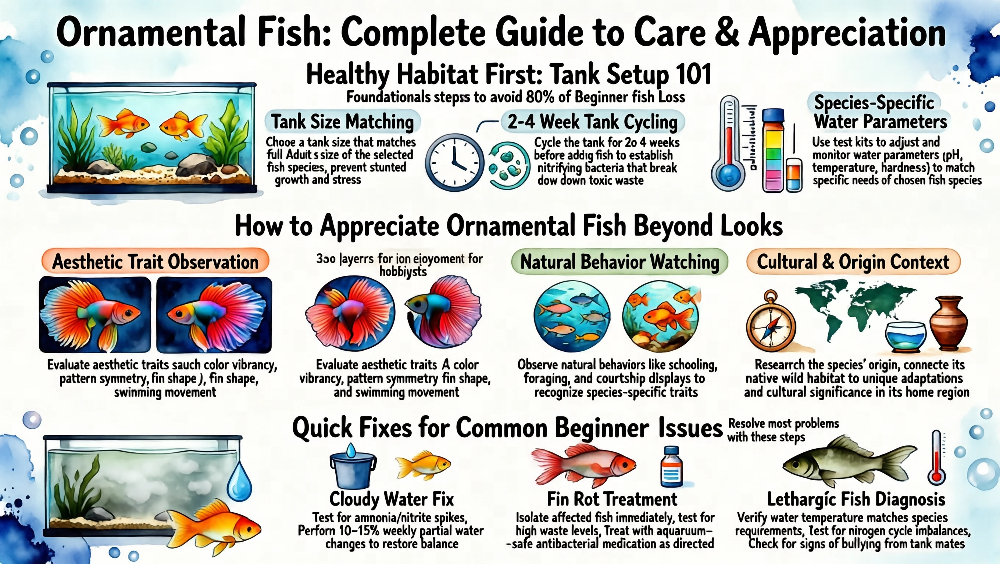</a></td>
  </tr>
  <tr>
    <td align="center"><a href="./docs/assets/showcases/t2i_infographic/0006.webp"></a></td>
    <td align="center"><a href="./docs/assets/showcases/t2i_infographic/0015.webp"></a></td>
    <td align="center"><a href="./docs/assets/showcases/t2i_infographic/0025.webp"></a></td>
  </tr>
</table>

<table align="center">
  <tr>
    <td align="center"><a href="./docs/assets/showcases/t2i_infographic/0000.webp"></a></td>
    <td align="center"><a href="./docs/assets/showcases/t2i_infographic/0003.webp"></a></td>
    <td align="center"><a href="./docs/assets/showcases/t2i_infographic/0001.webp"></a></td>
      <td align="center"><a href="./docs/assets/showcases/t2i_infographic/0022.webp"></a></td>
  </tr>
  <tr>
    <td align="center"><a href="./docs/assets/showcases/t2i_infographic/0016.webp"></a></td>
    <td align="center"><a href="./docs/assets/showcases/t2i_infographic/0010.webp"></a></td>
    <td align="center"><a href="./docs/assets/showcases/t2i_infographic/0007.webp"></a></td>
    <td align="center"><a href="./docs/assets/showcases/t2i_infographic/0021.webp"></a></td>
  </tr>
  <tr>
    <td align="center"><a href="./docs/assets/showcases/t2i_infographic/0014.webp">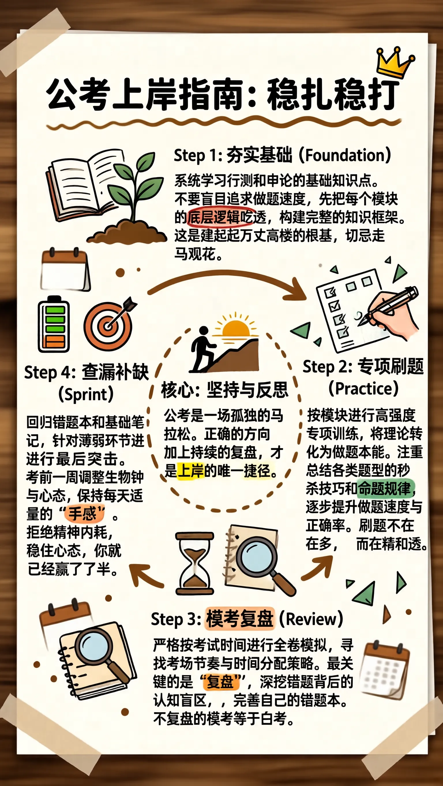</a></td>
    <td align="center"><a href="./docs/assets/showcases/t2i_infographic/0028.webp">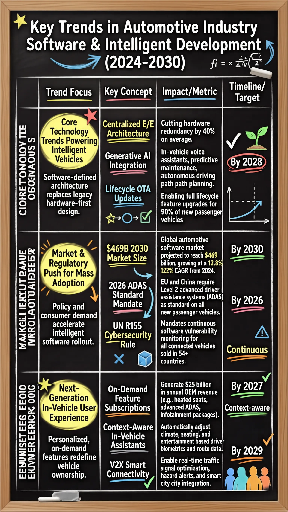</a></td>
    <td align="center"><a href="./docs/assets/showcases/t2i_infographic/0033.webp"></a></td>
    <td align="center"><a href="./docs/assets/showcases/t2i_infographic/0002.webp"></a></td>
  </tr>
  <tr>
    <td align="center"><a href="./docs/assets/showcases/t2i_infographic/0031.webp"></a></td>
    <td align="center"><a href="./docs/assets/showcases/t2i_infographic/0030.webp"></a></td>
    <td align="center"><a href="./docs/assets/showcases/t2i_infographic/0032.webp"></a></td>
    <td align="center"><a href="./docs/assets/showcases/t2i_infographic/0029.webp"></a></td>
  </tr>
</table>

</details>  

> 📸 **More generation samples:** see [Image Generation Gallery](./docs/showcases.md#text-to-image). 


<details>
<summary>✏️ Image Editing (General)</summary>

| | |
| :---: | :---: |
| <div align="center"><a href="./examples/editing/data/images/1.webp"></a> <a href="./docs/assets/showcases/editing/1_out.webp"></a><br><sub>Change the jacket of the person on the left to bright yellow.</sub></div> | <div align="center"><a href="./examples/editing/data/images/3.webp"></a> <a href="./docs/assets/showcases/editing/3_out.webp"></a><br><sub>在小狗头上放一个花环，并且把图片变为吉卜力风格。</sub></div> |
| <div align="center"><a href="./examples/editing/data/images/2.webp"></a> <a href="./docs/assets/showcases/editing/2_out.webp"></a><br><sub>Make the person in the image smile.</sub></div> | <div align="center"><a href="./examples/editing/data/images/4.webp"></a> <a href="./docs/assets/showcases/editing/4_out.webp"></a><br><sub>Add a bouquet of flowers.</sub></div> |
| <div align="center"><a href="./examples/editing/data/images/8.webp"></a> <a href="./docs/assets/showcases/editing/8_out.webp"></a><br><sub>Replace the man with a woman.</sub></div> | <div align="center"><a href="./examples/editing/data/images/6.webp"></a> <a href="./docs/assets/showcases/editing/6_out.webp"></a><br><sub>Replace the text "WARFIGHTER" to "BATTLEFIELD" in the bold orange-red font.</sub></div> | 

</details>


<details>
<summary>✏️ Image Editing (Reasoning)</summary>

<table>
  <tr>
    <th style="width: 20%">Original Text</th>
    <th style="width: 30%">Original Image</th>
    <th style="width: 20%">Reasoning Process</th>
    <th style="width: 30%">Resulting Image</th>
  </tr>
  <tr>
    <td style="vertical-align: top;">Draw what it will look like one hour later.</td>
    <td style="vertical-align: top;"></td>
    <td><div style="max-height: 200px; overflow-y: auto;">
    1. <b>Source Image Analysis:</b> The source image shows a glass cup of hot tea with steeping tea leaves, and the water appears relatively clear. 2. <b>Instruction Understanding:</b> The instruction asks for the appearance one hour later. 3. <b>Reasoning Process:</b> Over time, tannins and pigments leach out, making the tea noticeably darker and more uniformly colored, and the leaves may look more swollen and darker from soaking. 4. <b>Expected Visual Changes:</b> The expected visible result is a deeper amber-to-brown tea color and more fully saturated liquid. 5. <b>Elements to Preserve:</b> The glass cup, scattered leaves around it, background, and camera angle should remain unchanged. 6. <b>Explicit Edit Prompt:</b> Edit the tea liquid to a much darker, more saturated amber-brown color as if fully steeped, and make the tea leaves look slightly darker and more swollen, while keeping the glass cup, surrounding leaves, background, and framing unchanged.</div></td>
    <td style="vertical-align: top;"></td>
  </tr>
  <tr>
    <td style="vertical-align: top;">Draw what it will look like immediately after someone stands up from sitting on it for a long time.</td>
    <td style="vertical-align: top;"></td>
    <td><div style="max-height: 200px; overflow-y: auto;">
    1. <b>Source Image Analysis:</b> The source image shows a fluffy lime-green beanbag chair that looks evenly plump and undisturbed on a white background. 2. <b>Instruction Understanding:</b> The edit instruction asks for its appearance immediately after someone stood up from sitting there for a long time. 3. <b>Reasoning Process:</b> Prolonged weight compresses the fabric and internal fill, leaving a depressed seat area, wrinkles radiating outward, and a slowly recovering shape. 4. <b>Expected Visual Changes:</b> The visible result should be a noticeable dip and creasing where a person was seated. 5. <b>Elements to Preserve:</b> The background, beanbag color, lighting, and camera angle should remain unchanged while only the beanbag’s shape shows the compression. 6. <b>Explicit Edit Prompt:</b> Edit the beanbag chair to show a clear seated depression in the center with surrounding wrinkles and slightly compressed fabric, while keeping the white background, lighting, and camera angle unchanged.</div></td>
    <td style="vertical-align: top;"></td>
  </tr>
  <tr>
    <td style="vertical-align: top;">Change the water to high-concentration saltwater</td>
    <td style="vertical-align: top;"></td>
    <td><div style="max-height: 200px; overflow-y: auto;">
    1. <b>Source Image Analysis:</b> The source image shows an egg resting at the bottom of a glass of water. 2. <b>Instruction Understanding:</b> The instruction asks to change the medium to high-concentration saltwater. 3. <b>Reasoning Process:</b> Saltwater is denser than fresh water, which increases the buoyant force on the egg. 4. <b>Expected Visual Changes:</b> As density increases, the egg will overcome gravity and float higher or suspend in the middle of the liquid. 5. <b>Elements to Preserve:</b> The glass and the egg's appearance should remain consistent, focusing on the shift in the egg's vertical position. 6. <b>Explicit Edit Prompt:</b> Edit the position of the egg so it is floating in the middle of the liquid instead of resting on the bottom, while keeping the glass and the egg's appearance unchanged.</div></td>
    <td style="vertical-align: top;"></td>
  </tr>
  <tr>
    <td style="vertical-align: top;">What the fruit looks like when ripe in the picture</td>
    <td style="vertical-align: top;"></td>
    <td><div style="max-height: 200px; overflow-y: auto;">
    1. <b>Source Image Analysis:</b> The source image shows green, unripe bananas. 2. <b>Instruction Understanding:</b> The instruction asks for the appearance of the fruit when ripe. 3. <b>Reasoning Process:</b> Ripening involves a breakdown of chlorophyll and the production of sugars, which turns the skin from green to yellow and often causes small brown sugar spots to appear. 4. <b>Expected Visual Changes:</b> The color and texture of the peel should transition to a ripe state. 5. <b>Elements to Preserve:</b> The shape of the bananas and the white background should remain constant. 6. <b>Explicit Edit Prompt:</b> Edit the green bananas to be bright yellow with small brown spots, while keeping the original shape and white background unchanged.</div></td>
    <td style="vertical-align: top;"></td>
  </tr>
</table>

</details>   

> 📸 **More editing samples:** see [Image Editing Gallery](./docs/showcases.md#image-editing). 

<details>
<summary>♻️ Interleaved Generation (General)</summary>

| |
| :---: |
| [](./docs/assets/showcases/interleave/case_0005_matchgirl_warm_au.webp) |
| [](./docs/assets/showcases/interleave/case_0006_orange_cat_travel.webp) |

</details>


<details>
<summary>♻️ Interleaved Generation (Reasoning)</summary>

| |
| :---: |
| [](./docs/assets/showcases/interleave/reasoning.png) |

</details>

> 📸 **More interleaved samples:** see [Interleaved Generation Gallery](./docs/showcases.md#interleaved-generation).

<details>
<summary>📝 Visual Understanding (General)</summary>

| |
| :---: |
| [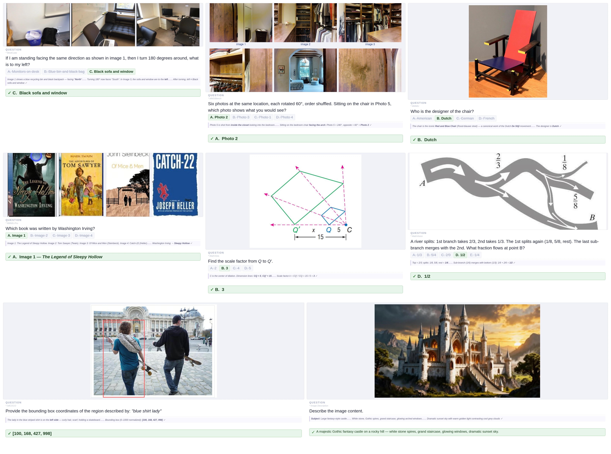](./docs/assets/showcases/vqa/general_case.webp) |

</details>

<details>
<summary>📝 Visual Understanding (Agentic)</summary>

| |
| :---: |
| [](./docs/assets/showcases/vqa/agentic_case.webp) |


</details>

> 📸 **More understanding samples:** see [Visual Understanding Gallery](./docs/showcases.md#visual-understanding). 


<details>
<summary>🦾 Visual-Language Action</summary>

[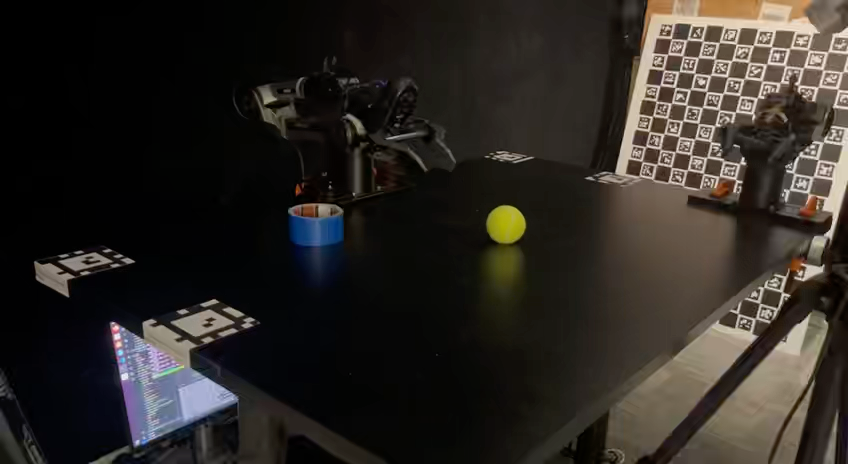](https://www.youtube.com/watch?v=3mvBPPgv8vo)
[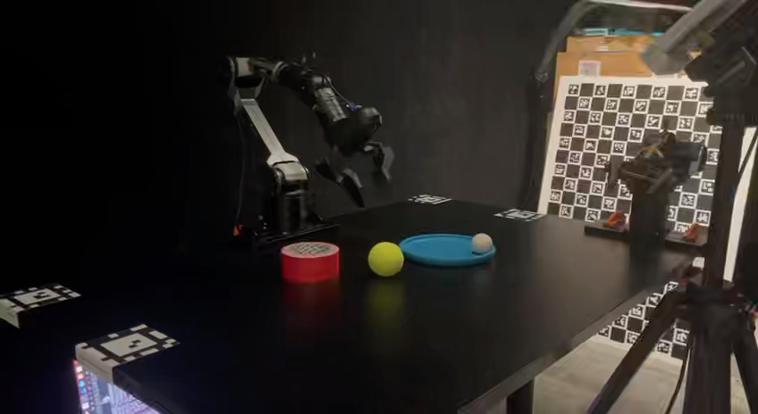](https://www.youtube.com/watch?v=2QZY8gf0Vsk)
[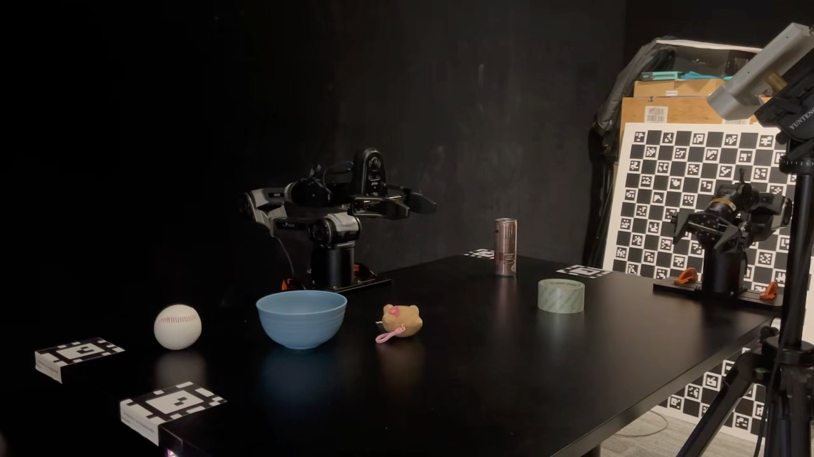](https://www.youtube.com/watch?v=tznVbuYf0yw)

</details>


## 📊 Key Benchmarks

<details>
<summary>📝 Visual Understanding</summary>

<p align="center">
  
</p>

</details>

<details>
<summary>🖼️ Visual Generation</summary>

<p align="center">
  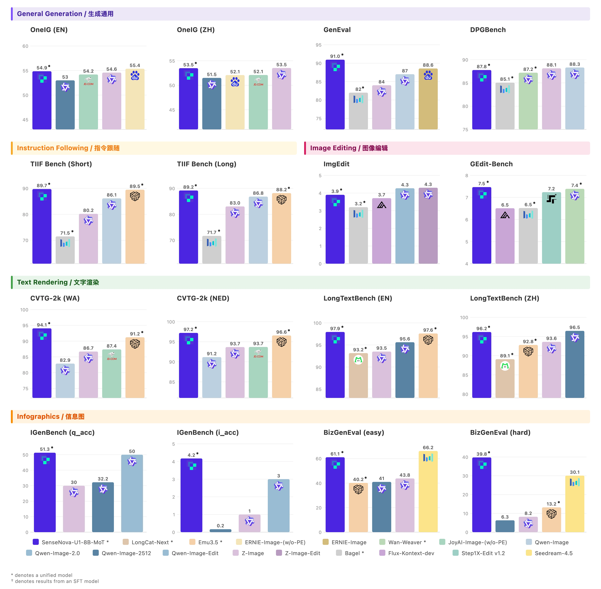
</p>

</details>

<details>
<summary>♻️ Visual Reasoning</summary>

<p align="center">
  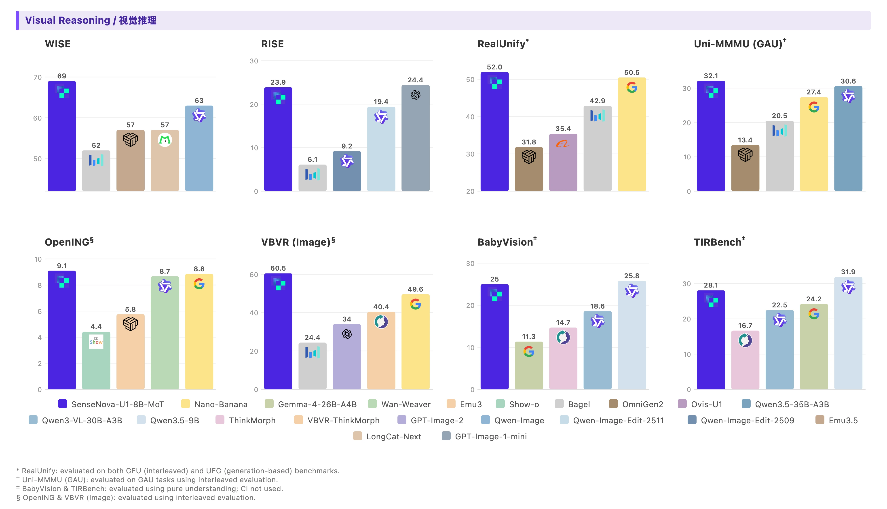
</p>

</details>

> Evaluation scripts and benchmark reproduction guides are added in [`evaluation`](./evaluation/README.md).

## ⚠️ Ongoing Improvements

Despite strong performance across tasks, several limitations remain for improvement:

* **Visual Understanding**:   
  The current model only supports a context length of up to **32K** tokens, which may constrain performance in scenarios requiring longer or more complex visual contexts.

* **Human-centric Generation**:   
  Fine-grained details of human bodies can be challenging, especially when people appear as small elements within a scene or are engaged in complex interactions with surrounding objects.

* **Text-based Generation**:   
  Text rendering may sometimes produce misspellings, distorted characters, or formatting inconsistencies, which are sensitive to how prompts are phrased, especially in text-heavy scenarios. (see [`prompt enhancement`](./docs/prompt_enhancement.md) for best practice)

* **Interleaved Generation**:   

  * As an experimental feature, interleaved generation is still evolving and may not yet match the performance of dedicated text-to-image (T2I) pipelines.   

  * **Beta status:** RL has not been specifically optimized for visual editing, reasoning, and interleaved tasks, and current performance is comparable SFT models.

We view these areas as active directions and expect continued improvements in future iterations.


## 🛠️ Quick Start


### 🌐 Use with SenseNova-Studio

The fastest way to experience SenseNova-U1 is through **[SenseNova-Studio](https://unify.light-ai.top/)** — a 🆓 free online playground where you can try the model directly in your browser, no installation or GPU required.

> **Note:** To serve more users, U1-Fast has undergone step and CFG distillation, and is dedicated to infographic generation.


### 🦞 Use with SenseNova-Skills (OpenClaw)

The easiest way to integrate SenseNova-U1 into your own agent or application is through our companion repository **[SenseNova-Skills (OpenClaw) 🦞](https://github.com/OpenSenseNova/SenseNova-Skills)**, which ships SenseNova-U1 as a ready-to-use skill with a unified tool-calling interface.

> Refer to the [SenseNova-Skills README](https://github.com/OpenSenseNova/SenseNova-Skills) for installation and usage details.

<details>
<summary>✨ Some interesting cases produced through our Skills and Studio</summary>

<p align="center">
  
</p>

</details>

### 🤗 Run with transformers (Default)

> **Setup:** Follow the [Installation Guide](./docs/installation.md) to clone the repo and install dependencies with [uv](https://github.com/astral-sh/uv).

<details open>
<summary>📝 Visual Understanding</summary>

```bash
python examples/vqa/inference.py --model_path SenseNova/SenseNova-U1-8B-MoT --image examples/vqa/data/images/menu.jpg --question "My friend and I are dining together tonight. Looking at this menu, can you recommend a good combination of dishes for 2 people? We want a balanced meal — a mix of mains and maybe a starter or dessert. Budget-conscious but want to try the highlights." --output outputs/answer.txt --max_new_tokens 8192 --do_sample --temperature 0.6 --top_p 0.95 --top_k 20 --repetition_penalty 1.05 --profile
```

</details>

> See [`examples/README.md`](./examples/README.md#visual-understanding-vqa) for batched inference, generation parameters, and JSONL format.

<details open>
<summary>🖼️ Text-to-Image</summary>

```bash
python examples/t2i/inference.py --model_path SenseNova/SenseNova-U1-8B-MoT --prompt "这张信息图的标题是“SenseNova-U1”，采用现代极简科技矩阵风格。整体布局为水平三列网格结构，背景是带有极浅银灰色细密点阵的哑光纯白高级纸张纹理，画面长宽比为16:9。\n\n排版采用严谨的视觉层级：主标题使用粗体无衬线黑体字，正文使用清晰的现代等宽字体。配色方案极其克制，以纯白色为底，深炭黑为主视觉文字和边框，浅石板灰用于背景色块和次要信息区分，图标采用精致的银灰色线框绘制。\n\n在画面正上方居中位置，使用醒目的深炭黑粗体字排布着大标题“SenseNova-U1”。标题正下方是浅石板灰色的等宽字体副标题“新一代端到端统一多模态大模型家族”。\n\n画面主体分为左、中、右三个相等的垂直信息区块，区块之间通过充足的负空间进行物理隔离。\n\n左侧区块的主题是概述。顶部有一个银灰色线框绘制的、由放大镜和齿轮交织的图标，旁边是粗体小标题“Overview”。该区块内从上到下垂直排列着三个要点：第一个要点旁边是一个代表文档与照片重叠的极简图标，紧跟着文字“多模态模型家族，统一文本/图像理解和生成”。向下是由两个相连的同心圆组成的架构图标，配有文字“基于NEO-Unify架构（端到端统一理解和生成）”。最下方是一个带有斜线划掉的眼睛和漏斗形状的图标，明确指示文本“无需视觉编码器(VE)和变分自编码器(VAE)”。\n\n中间区块展示模型矩阵。顶部是一个包含两个分支节点的树状网络图标，旁边是粗体小标题“两个模型规格”。区块内分为上下两个包裹在浅石板灰色极细边框内的卡片。上方的卡片内画着一个代表高密度的实心几何立方体图标，大字标注“SenseNova-U1-8B-MoT”，下方是等宽字体说明“8B MoT 密集主干模型”。下方的卡片内画着一个带有闪电符号的网状发光大脑图标，大字标注“SenseNova-U1-A3B-MoT”，下方是等宽字体说明“A3B MoT 混合专家（MoE）主干模型”。在这两个独立卡片的正下方，左侧放置一个笑脸轮廓图标搭配文字“将在HF等平台公开”，右侧放置一个带有折角的书面报告图标搭配文字“将发布技术报告”。\n\n右侧区块呈现核心优势。顶部是一个代表巅峰的上升阶梯折线图图标，旁边是粗体小标题“Highlights”。该区块内部垂直分布着四个带有浅石板灰底色的长方形色块，每个色块内部左侧对应一个具体的图标，右侧为文字。第一个色块内是一个无缝相连的莫比乌斯环图标，配文“原生统一架构，无VE和VAE”。第二个色块内是一个顶端带有星星的奖杯图标，配文“单一统一模型在理解和生成任务上均达到SOTA性能”。第三个色块内是代表文本行与拍立得照片交替穿插的图标，配文“强大的原生交错推理能力（模型原生生成图像进行推理）”。最后一个色块内是一个被切分出一小块的硬币与详细饼状图结合的图标，配文“能生成复杂信息图表，性价比出色”。" --width 2720 --height 1536 --cfg_scale 4.0 --cfg_norm none --timestep_shift 3.0 --num_steps 50 --output output.png --profile
```

</details>

> Default resolution is 2048×2048 (1:1). See [supported resolution buckets](./examples/README.md#supported-resolution-buckets) for other aspect ratios.

> For high-quality infographic generation, it is recommended to apply [prompt enhancement](./docs/prompt_enhancement.md) before generating images.


<details open>
<summary>✏️ Image Editing</summary>

```bash
python examples/editing/inference.py --model_path SenseNova/SenseNova-U1-8B-MoT --prompt "Change the animal's fur color to a darker shade." --image examples/editing/data/images/1.jpg --cfg_scale 4.0 --img_cfg_scale 1.0 --cfg_norm none --timestep_shift 3.0 --num_steps 50 --output output_edited.png --profile --compare
```

</details>

> 💡 Pre-resize inputs to ~2048×2048 resolution with orginal aspect ratio before inference for best quality (see [`examples/editing/resize_inputs.py`](./examples/editing/resize_inputs.py)).


<details open>
<summary>♻️ Interleaved Generation</summary>

```bash
python examples/interleave/inference.py --model_path SenseNova/SenseNova-U1-8B-MoT --prompt "I want to learn how to cook tomato and egg stir-fry. Please give me a beginner-friendly illustrated tutorial." --resolution "16:9" --output_dir outputs/interleave/ --stem demo --profile
```
</details>

> See [`examples/README.md`](./examples/README.md) for batched inference, JSONL format, prompt enhancement, resolution buckets, and full flag reference.


### ⚡ Run with LightLLM + LightX2V (Recommended)

For production serving, we co-design a dedicated inference stack on top of **[LightLLM](https://github.com/ModelTC/lightllm)** (understanding) and **[LightX2V](https://github.com/ModelTC/lightx2v)** (generation). The two engines are disaggregated so that each path can use its own parallelism and resource budget, with a low-overhead transfer channel in between.

On a single node with `TP2 + CFG2`, this stack delivers roughly **~0.15 s/step** and **~9 s end-to-end** for a **2048×2048** image on H100 / H200, with a ~**2.4–3.2×** prefill speedup from our FA3-based hybrid-mask attention over the Triton baseline. Full per-GPU performance are reported in [`docs/inference_infra.md`](./docs/inference_infra.md).

An official docker image is provided for one-command deployment:

```bash
docker pull lightx2v/lightllm_lightx2v:20260407
```

> ⚙️ **Deployment guide (Docker, launch flags, modes, quantization, API test):** see [`docs/deployment.md`](./docs/deployment.md).
>
> 📖 **Full design and performance profiling:** see [`docs/inference_infra.md`](./docs/inference_infra.md).

<!-- ## 🖊️ Citation

```bibtex

``` -->

## 🌐 Join the Community!

Join our growing community to share feedback, get support, and stay updated on the latest SenseNova-U1 developments — we'd love to hear from you!

<div align="center">
<table>
  <tr>
    <td align="center"><b><a href="https://discord.gg/cxkwXWjp">Discord</a></b></td>
    <td align="center"><b>WeChat Group</b></td>
  </tr>
  <tr>
    <td align="center"><a href="https://discord.gg/cxkwXWjp"></a></td>
    <td align="center"></td>
  </tr>
</table>
</div>

## ⚖️ License

This project is released under the [Apache 2.0 License](./LICENSE).
