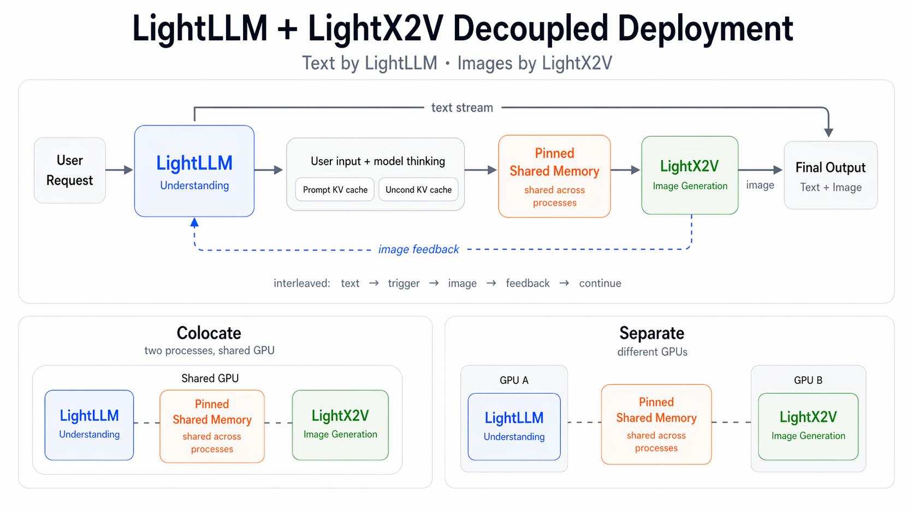
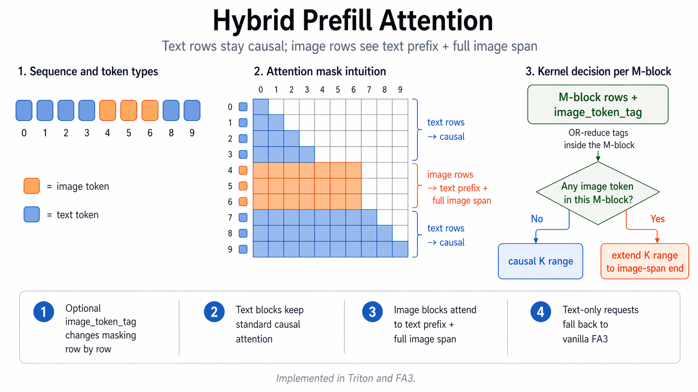

# 推理基础设施

本文档介绍 **SenseNova-U1** 的推理基础设施，其构建于 **[LightLLM](https://github.com/ModelTC/lightllm)** 与 **[LightX2V](https://github.com/ModelTC/lightx2v)** 之上。

## 总览

SenseNova-U1 对外呈现为一个统一的多模态模型，但在实际生产中，理解与生成两条路径的执行形态差异显著：二者在调度策略、并行方案与资源配比上各有偏好，难以用同一套服务配置覆盖。若将它们耦合在单一的整体运行时中，各自的选择会被无谓地绑死，结果往往是两条路径都偏离各自的最优工作点。

为避免这种耦合，SenseNova-U1 采用**解耦**架构：

- **LightLLM** 负责理解、文本流式输出与控制流；
- **LightX2V** 负责图像生成。

两个引擎通过 pinned 共享内存与高性能传输内核交换生成状态，交接过程轻量，同时各自仍可按最优执行策略独立运行。

该设计在生产中具有以下实际收益：

- 并行策略相互独立（例如理解侧 `TP=2`（张量并行=2），生成侧 `CFG=2`（CFG 并行=2）或 `SP=2`（序列并行=2））；
- 资源配额相互独立（可分配不同的 GPU 数量与显存预算）；
- 针对文本密集型与图像密集型流量可分别弹性扩缩；
- 运维隔离更清晰，性能调优也更简单。

同一架构可根据硬件预算与流量特征，在两种模式下部署：

- **Separate（分离部署）**：LightLLM 与 LightX2V 运行在不同的 GPU 组上；
- **Colocate（共置部署）**：LightLLM 与 LightX2V 作为独立进程运行在同一张 GPU 上。

生产环境中，`Separate` 是默认选择，其瓶颈定位更清晰，也便于独立扩缩；`Colocate` 则更适合快速验证、生成密集型场景或 GPU 数量有限的部署。

### NEO-Unify 多模态 Prefill 的注意力

NEO-Unify 的 prefill 注意力并非标准因果注意力：文本 token 仍保持因果，而图像 token 则会同时关注整个文本前缀以及完整的图像 span。为支持这种混合掩码，我们对栈内两套注意力实现都进行了改造——Triton 内核与官方 FlashAttention3 (FA3) 代码库。我们的 FA3 分支见 [WANDY666/flash-attention](https://github.com/WANDY666/flash-attention)。

具体做法是新增一个可选的 image_token_tag 参数，用以逐行调整掩码：文本行沿用标准因果掩码；图像行不再采用朴素的因果截断，而是被允许关注其之前的全部文本 token，以及所在图像 span 内的全部图像 token。

为在尽可能多的情况下保留因果三角形带来的加速，内核按 M-block 粒度进行判断——对当前 block 内的 image_token_tag 做 OR-reduce：若该 block 不含图像 token，则维持标准因果 K-range；若含有图像 token，则将 K-range 扩展至覆盖所需的图像 span。因此纯文本 block 仍走常规因果路径，只有真正相关的 block 才承担混合掩码引入的额外开销。

额外开销并不取决于某个固定比例，而是取决于图像 token 在序列中的分布，以及它们跨 M-block 边界的方式。当图像行仅集中在序列的某一部分时，额外开销也被相应地局部化。对于纯文本请求，image_token_tag 为空，内核即回落至原生 FA3，没有任何额外开销。

下表对比了 Neo 风格多模态 prefill 的两种实现：

- **Triton 实现**：更容易迁移到现有代码库，集成成本低、迭代更快；
- **FA3 实现**：在受支持的硬件上绝对性能更高。

|  batch  | max_seq_len | image_token_num | triton (ms) | FA3 (ms) | 加速比 (×) |
|:-------:|:-----------:|:---------------:|:-----------:|:--------:|:----------:|
|    8    |     4096    |       88        |    1.95     |   0.81   |  **2.41×** |
|    8    |     8192    |       171       |    6.55     |   2.68   |  **2.45×** |
|    8    |    65536    |       150       |   43.30     |  14.95   |  **2.90×** |
|   16    |     4096    |       379       |    4.12     |   1.68   |  **2.46×** |
|   16    |     8192    |       246       |   17.76     |   7.40   |  **2.40×** |
|   16    |    65536    |       206       |  107.74     |  33.66   |  **3.20×** |
|   32    |     4096    |       726       |    8.46     |   3.46   |  **2.44×** |
|   32    |     8192    |       536       |   31.74     |  13.24   |  **2.40×** |
|   32    |    65536    |       417       |  171.00     |  58.26   |  **2.94×** |
|   64    |     4096    |       1170      |   16.08     |   6.88   |  **2.34×** |
|   64    |     8192    |       1177      |   55.48     |  22.91   |  **2.42×** |
|   64    |    65536    |       1291      |  348.89     | 124.82   |  **2.80×** |
|  128    |     4096    |       2057      |   30.89     |  12.53   |  **2.47×** |
|  128    |     8192    |       2196      |  104.73     |  43.22   |  **2.42×** |
|  128    |    65536    |       2205      |  706.60     | 241.67   |  **2.92×** |

### 部署

Docker 镜像、启动命令与 API 测试的简明操作手册，请参见 [`deployment_CN.md`](./deployment_CN.md)。

### 生成性能

下表给出 **SenseNova-U1-8B-MoT(NEO-Unify)** 在
**2048x2048** 图像生成任务上的基准模版。列出了不同机型与部署配置下的实测数据。
注：TP2+CFG2 表示张量并行=2 + CFG 并行=2。

| GPU  | 部署配置 | 单步延迟 (s/step) | 端到端延迟 (s) |
|:----:|:--------:|:-----------------:|:--------------:|
| H100 | TP2+CFG2 / colocate | 0.158 | 9.23 |
| H200 | TP2+CFG2 / colocate | 0.152 | 9.54 |
| 5090 | TP2+CFG2 / separate | 0.415 | 23.04 |
| L40S | TP2+CFG2 / separate | 0.443 | 25.62 |

在 NEO-Unify 中，生成阶段所用的 KV cache 由理解模块提供，因此 T2I（文生图）与 I2I（图像编辑）在运行时特征上几乎一致。为简洁起见，此处仅给出 T2I 的延迟数据。

### 跨模型速度对比

下表对比了在启用**CFG**条件下，生成 **2048x2048** 图像时单个 diffusion step 的延迟。除特别说明外，所有数据均在 **H100** 上测得；其中 `SenseNova-U1-8B-MoT (NEO-Unify, TP2+CFG2)` 使用的是 `2x H100`。
注：TP2+CFG2 表示张量并行=2 + CFG 并行=2。

|           模型            | 理解模块 | 生成模块 | 单步延迟 (s/step) |
|:-------------------------:|:--------:|:--------:|:-----------------:|
| Qwen-Image-2512           |    7B    |   20B    |       1.478       |
| Z-Image                   |    4B    |    6B    |       1.110       |
| GLM-Image                 |    9B    |    7B    |       1.394       |
| ERNIE-Image               |    8B    |    8B    |       1.565       |
| LongCat-Image             |    8B    |    6B    |       0.796       |
| SenseNova-U1-8B-MoT (NEO-Unify) |   8B    |    8B    |       0.312       |
| SenseNova-U1-8B-MoT (NEO-Unify, TP2+CFG2) |    8B    |    8B    |       0.158       |

