# Prompt Enhancement for SenseNova-U1

> Short user prompts — especially for **infographic** generation —
> often under-constrain the image model. Running the raw prompt through a
> strong LLM enhancer first consistently lifts structure, typography,
> information density, and "brief-readability" of the final image. This
> document describes how to turn it on, which upstream LLMs we recommend,
> and what the tradeoffs look like.

## 1. When to use

Use `--enhance` when:

- The user prompt is short or only names a topic (e.g. `"A chart about AI hardware in 2026"`).
- You are generating for demo / deck / poster use and can afford one extra
  LLM round-trip before the T2I call.

Skip `--enhance` when:

- The user already supplies a long, structured, production-ready prompt.
- Latency or third-party API cost is the primary concern.


## 2. How it works

```
user prompt ──► LLM (system prompt = infographic expander) ──► expanded prompt ──► SenseNova-U1
```

## 3. Configuration

All configuration is environment-variable based so the same script can
switch backends without code changes.

| Env var | Default | Purpose |
| :------ | :------ | :------ |
| `U1_ENHANCE_BACKEND`  | `chat_completions` | `chat_completions` (OpenAI-compatible) or `anthropic` |
| `U1_ENHANCE_ENDPOINT` | Gemini OpenAI-compat URL | Full `/chat/completions` or `/v1/messages` URL |
| `U1_ENHANCE_MODEL`    | `gemini-3.1-pro`   | Model name string sent in the request body |
| `U1_ENHANCE_API_KEY`  | _unset_            | Bearer token (required) |

First, create a `.env` file and populate it with the four required parameters. Then just add `--enhance` to your `examples/t2i/inference.py` command line.
Add `--print_enhance` to echo the original + enhanced prompt for
debugging.

To use **SenseNova 6.7 Flash-Lite** as the enhancer, get an API key from
[SenseNova Console · token-plan](https://platform.sensenova.cn/token-plan),
then set:

```bash
U1_ENHANCE_BACKEND=chat_completions
U1_ENHANCE_ENDPOINT=https://token.sensenova.cn/v1/chat/completions
U1_ENHANCE_MODEL=sensenova-6.7-flash-lite
U1_ENHANCE_API_KEY=<your SenseNova API key>
```

### 3.1 Recommended backends

| Model | Backend | Endpoint template | Notes |
| :---- | :------ | :---------------- | :---- |
| **Gemini 3.1 Pro** (Default) | `chat_completions` | `https://generativelanguage.googleapis.com/v1beta/openai/chat/completions` | Best overall infographic quality in our internal bench. Excellent at structured / hierarchical content. |
| SenseNova 6.7 Flash-Lite | `chat_completions` | `https://token.sensenova.cn/v1/chat/completions` | Near Gemini 3.1 Pro quality on Chinese content at lower per-token cost, preferred for production. |
| Anthropic Claude (Sonnet/Opus) | `anthropic`        | `https://api.anthropic.com/v1/messages` | Strong typography discipline, slightly less "information-dense" out of the box. |
| Kimi 2.5                      | `chat_completions` | `https://api.moonshot.cn/v1/chat/completions` | Good Chinese enhancements, weaker for English-dense infographics in our runs. |
| Gemini 3.1 Flash-Lite (Third-party service) | `chat_completions` | `https://aigateway.edgecloudapp.com/v1/f194fd69361cd590f1fa136c9c90eca1/senseai` | The overall quality of the information chart is high and its generation speed is fast. |
| Kimi 2.5/Qwen3.6-Plus (Third-party service) | `chat_completions` | `https://coding.dashscope.aliyuncs.com/v1/chat/completions` | Good Chinese enhancements. Different models can be flexibly selected. |

## 4. Qualitative comparison

> The table below will be populated with side-by-side samples from the same
> handful of base prompts, rendered at `2048×2048` with identical sampler
> knobs. PRs with new backends welcome.

| Base prompt | No enhance | Gemini 3.1 Pro | SenseNova | Qwen3.6-Plus | Kimi 2.5 |
| :---------- | :------------- | :------------- | :------------- | :------------- | :------------- |
| 生成一副西红柿炒鸡蛋的中文教程图 | 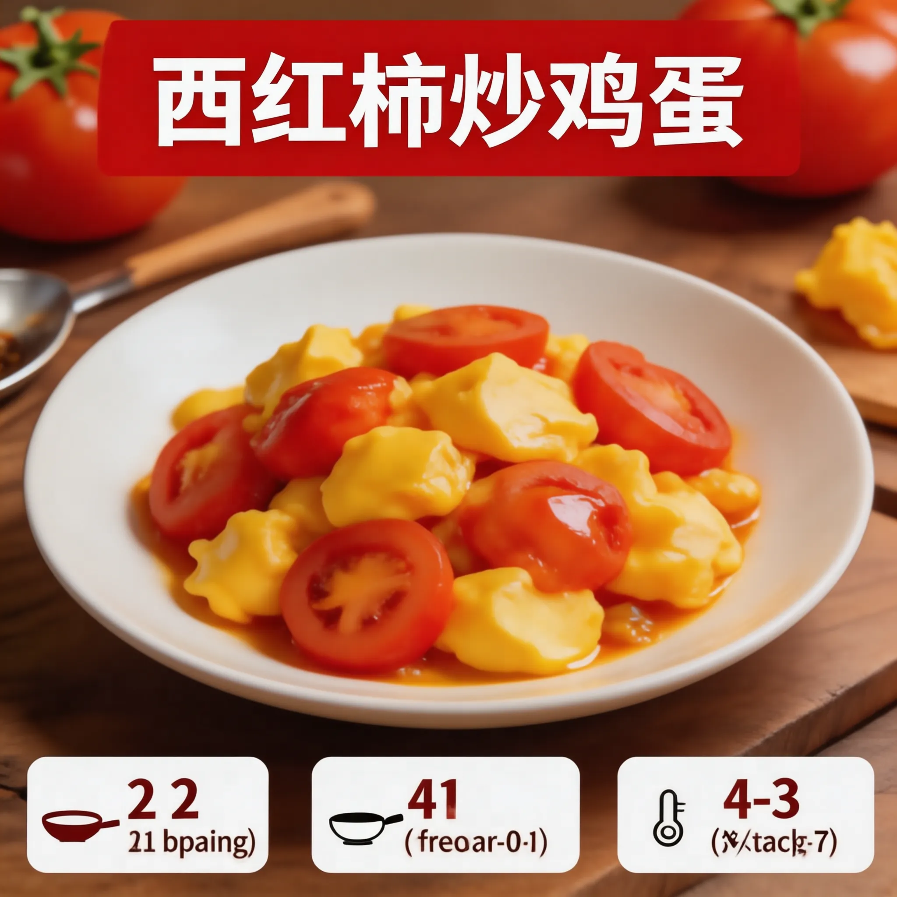 | 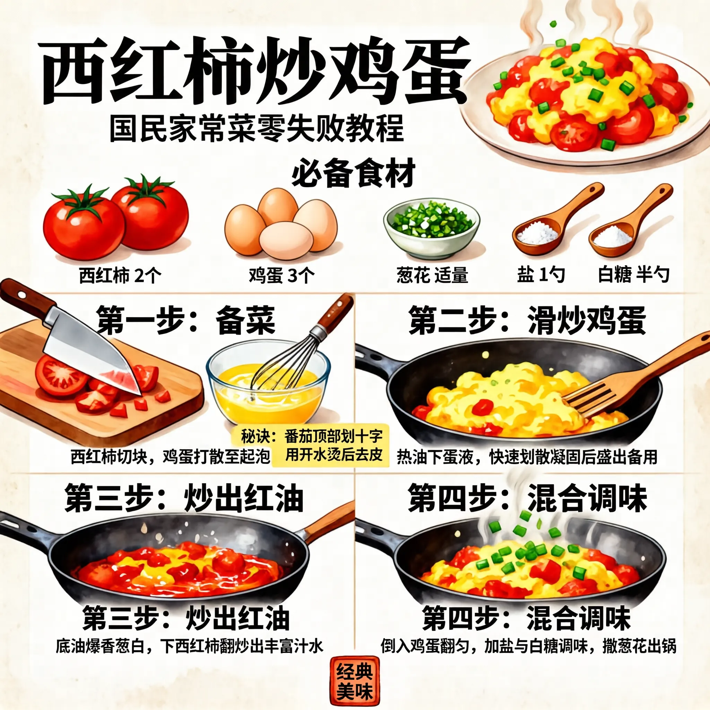 | 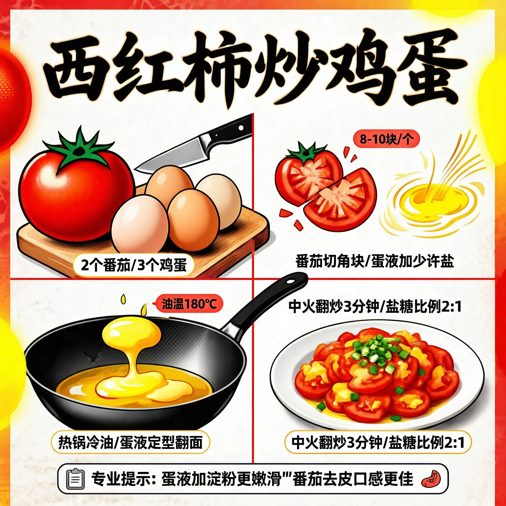 | 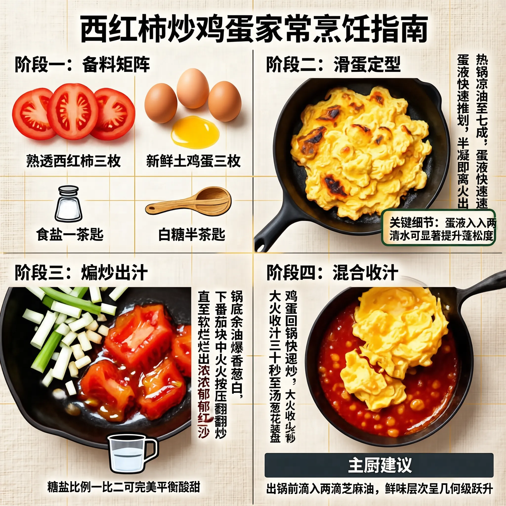 | 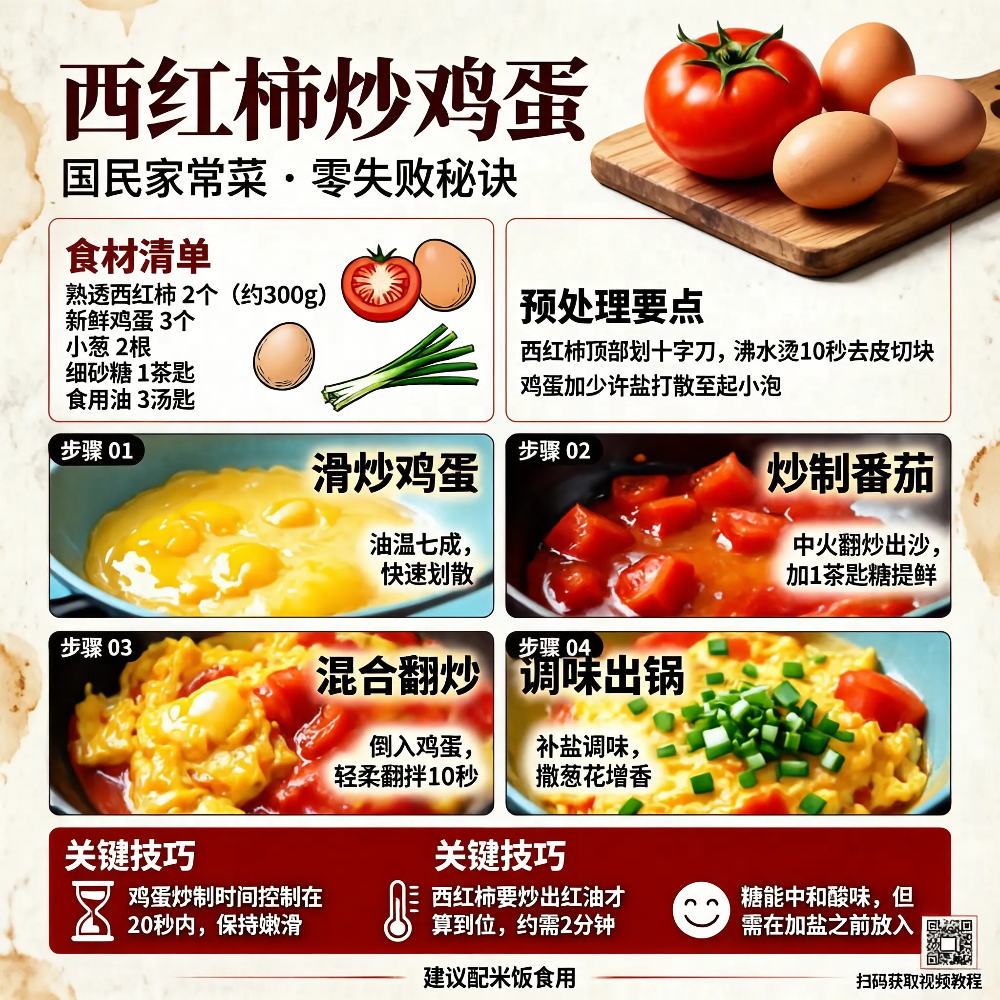 |
| 生成一张介绍乒乓球比赛规则的图片 | 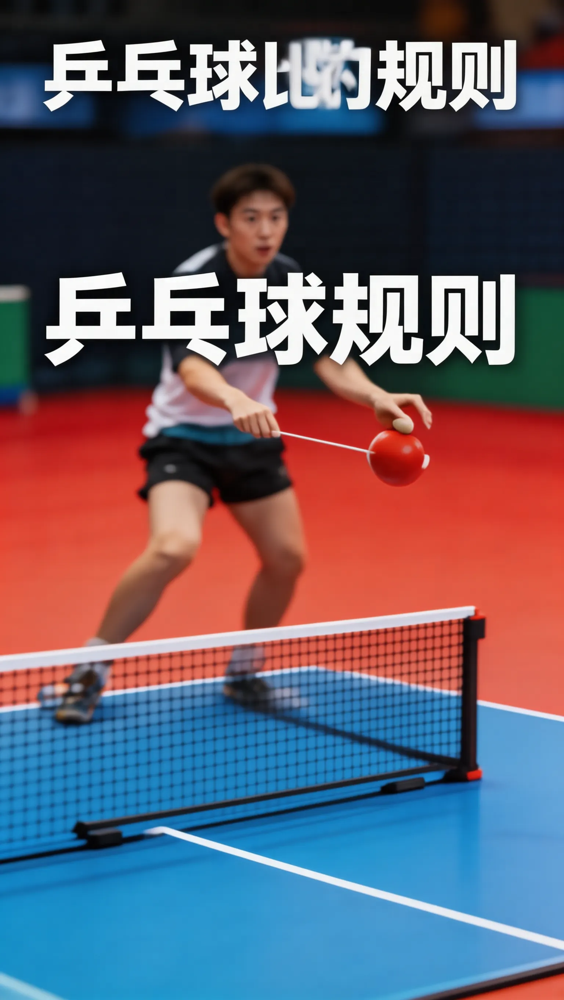 |  | 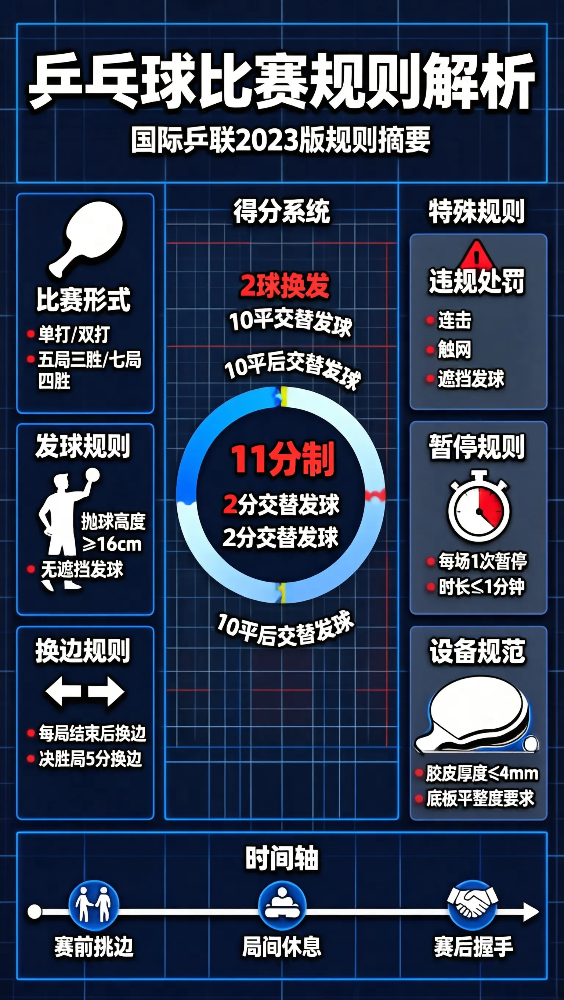 | 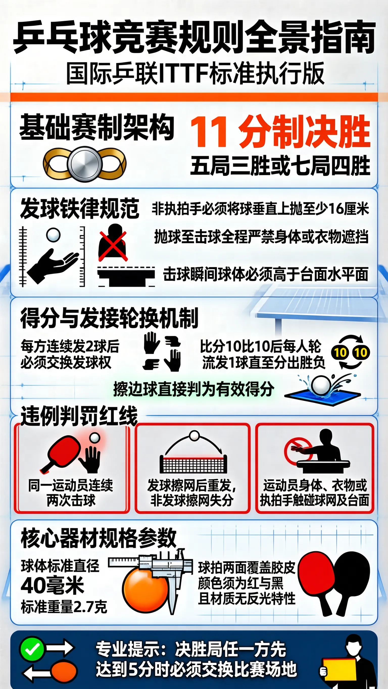 | 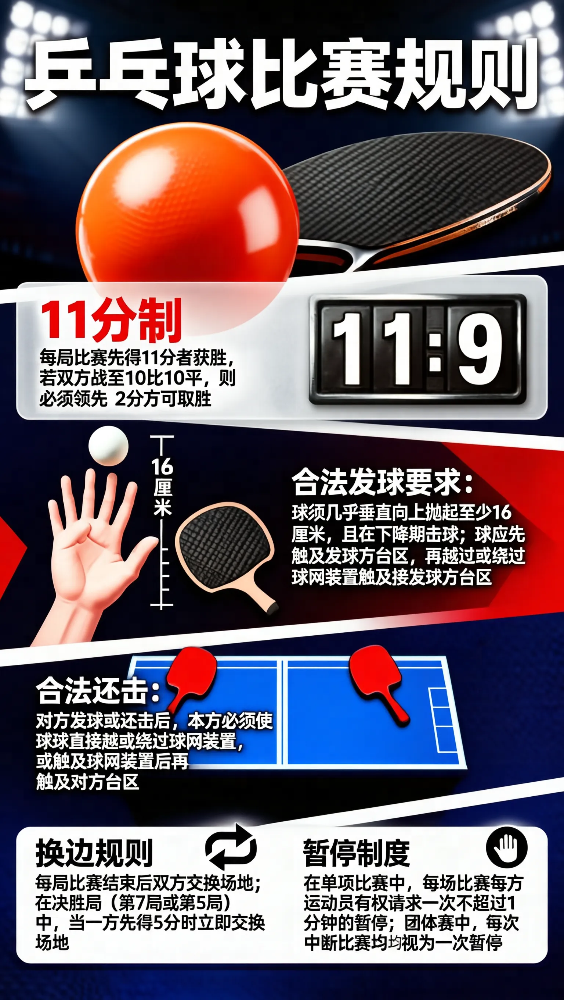 |
| Popularizing the importance of three meals a day | 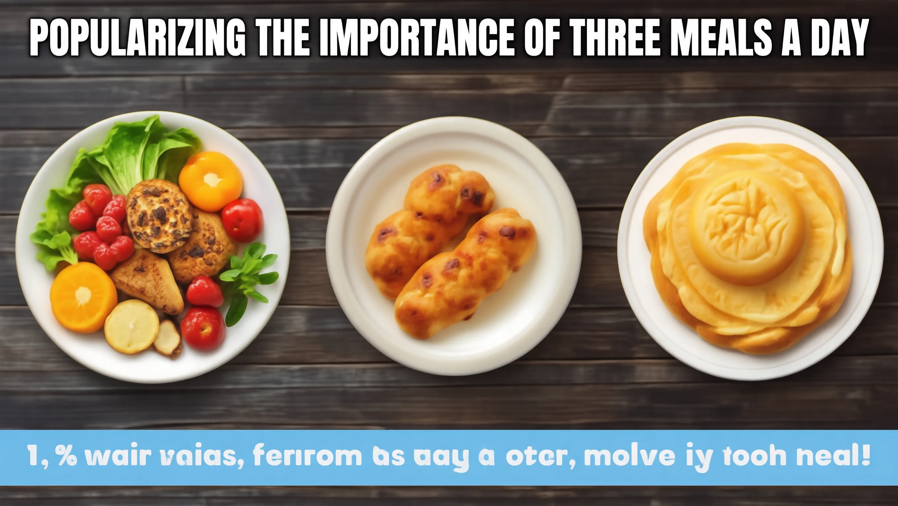 | 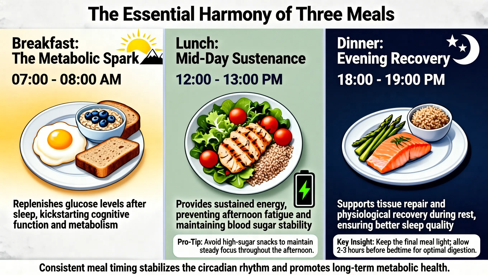 | 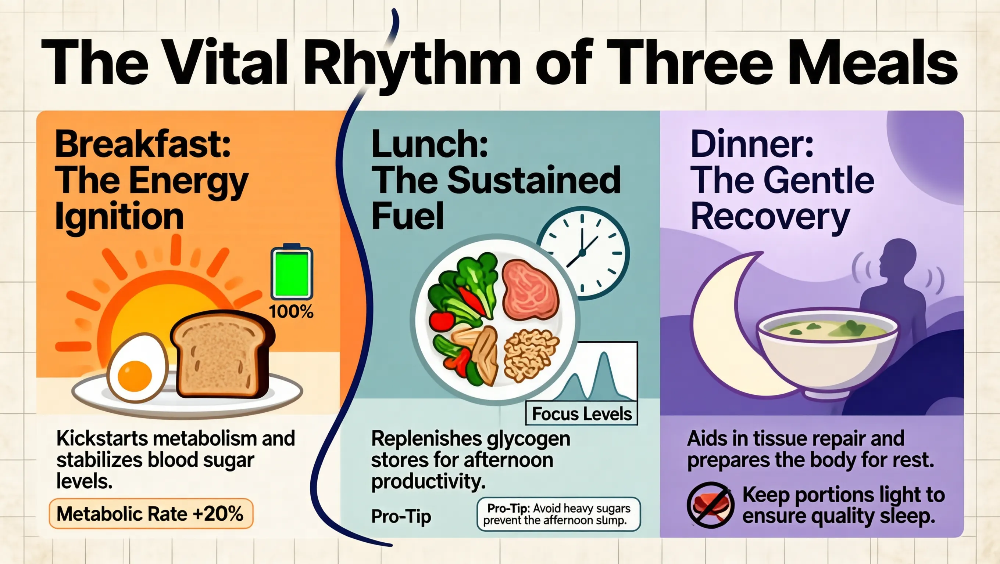 | 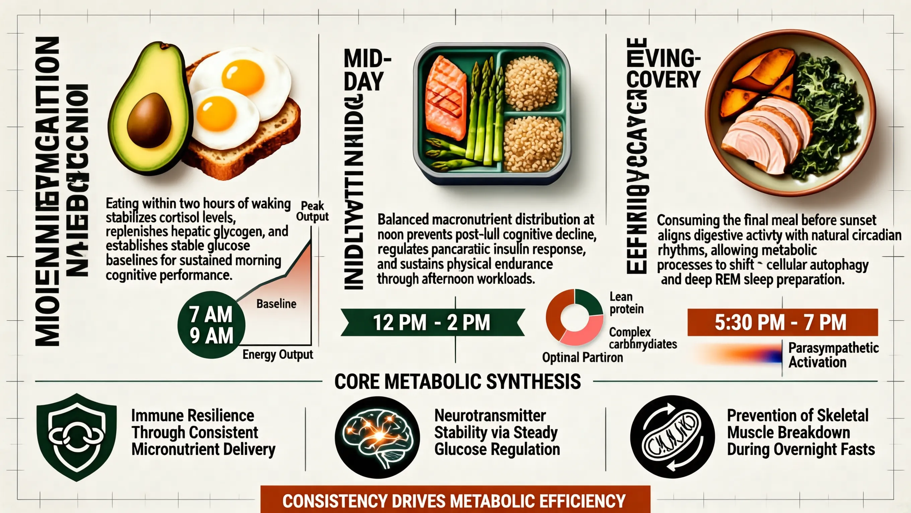 | 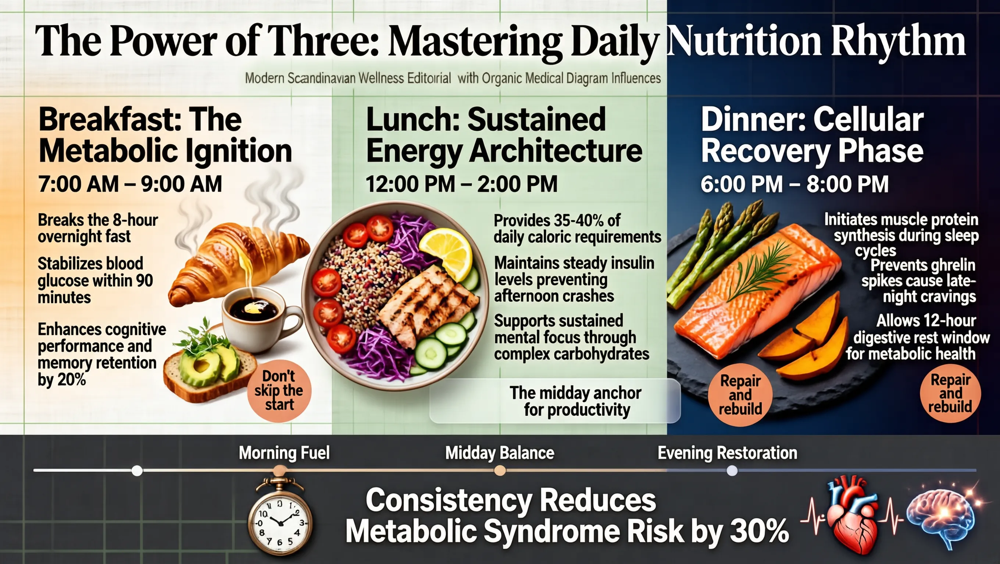 |
| <details><summary>点击查看详细 Prompt</summary>这张信息图的标题是“猫咪与狗狗的终极对决”，采用了日系极致可爱与强烈色彩对比的插画风格。整体布局为左右对称的双栏对比结构，背景是带有细腻水彩纸纹理的米白色。画面通过色彩进行强烈的视觉分区，左半部分背景叠加了浅薄荷绿色的半透明波点图案，右半部分背景叠加了暖珊瑚粉色的对角线斜纹图案。长宽比为16:9。\n\n画面的正上方居中位置，使用超大号的粗体圆润无衬线字体写着主标题“猫咪与狗狗的终极对决”。主标题下方，使用稍小字号的深灰色黑体字写着副标题“毛孩子性格与生活方式指南”。在副标题的两侧，分别画着一个带有粉色肉垫的猫爪印图案和一个带有灰色指甲的狗爪印图案。\n\n在画面的正中央垂直方向，有一条由明黄色虚线构成的中轴线，将画面完美切割为左右两部分。中轴线的正中央，放置着一个带有爆炸星芒边缘的亮橙色圆形徽章，徽章内部用夸张的粗体等宽英文字母写着“VS”。\n\n画面左侧是猫咪的专属区域。顶部有一幅精美的插画：一只拥有大眼睛、脸颊红润的胖乎乎英国短毛猫，头顶带着一个小皇冠。插画下方用深绿色的粗体字写着“傲娇猫星人”。向下延伸，有三个垂直排列的信息模块。第一个模块中，画着一只蜷缩在原木高书架顶层熟睡的橘猫，旁边紧挨着文字“独立自主：每天需要16小时睡眠”。第二个模块中，画着一个印有小鱼骨头图案的浅蓝色陶瓷碗，碗里装满新鲜的生鱼片和鸡肉块，碗的右侧写着“纯肉食动物：需要高蛋白”。第三个模块中，画着一个半开的棕色纸箱，纸箱缝隙里露出一双发光的猫眼，旁边写着“暗中观察：喜欢狭小隐蔽的空间”。在左侧的最底部，有一个带边框的提示框，里面用倾斜的黑体字写着“专家提示：给猫咪充足的私人空间”。\n\n画面右侧是狗狗的专属区域。顶部有一幅生动的插画：一只吐着舌头、耳朵飞扬的金色寻回犬，脖子上戴着红色的波点项圈。插画下方用深红色的粗体字写着“热情汪星人”。向下延伸，同样有三个垂直排列的信息模块，与左侧保持完美的水平对齐。第一个模块中，画着一只前爪腾空、嘴里叼着绿色飞盘的边境牧羊犬，旁边紧挨着文字“社交达人：需要户外互动与奔跑”。第二个模块中，画着一个不锈钢宠物碗，里面装着混合了骨头形状饼干、胡萝卜丁和肉粒的狗粮，碗的左侧写着“杂食动物：营养均衡最重要”。第三个模块中，画着一只站立在后腿上、用双爪抱着人类大腿的小型贵宾犬，旁边写着“随时求抱抱：极度依赖主人的陪伴”。在右侧的最底部，有一个与左侧对称的提示框，里面用倾斜的黑体字写着“专家提示：保证每日充足的户外运动”。\n\n在画面的正下方，跨越左右两个区域，有一个淡黄色的宽大横幅。横幅内部用醒目的深藏青色粗体字写着“结论：无论性格如何，都是我们的完美伴侣！”横幅两端分别画着一颗跳动的红色爱心图案。整个画面信息密度极高，文字排版层次分明，色彩对比强烈且极具亲和力，所有元素均清晰可见且无重叠。图像的整体宽高比设定为9:16。</details> | 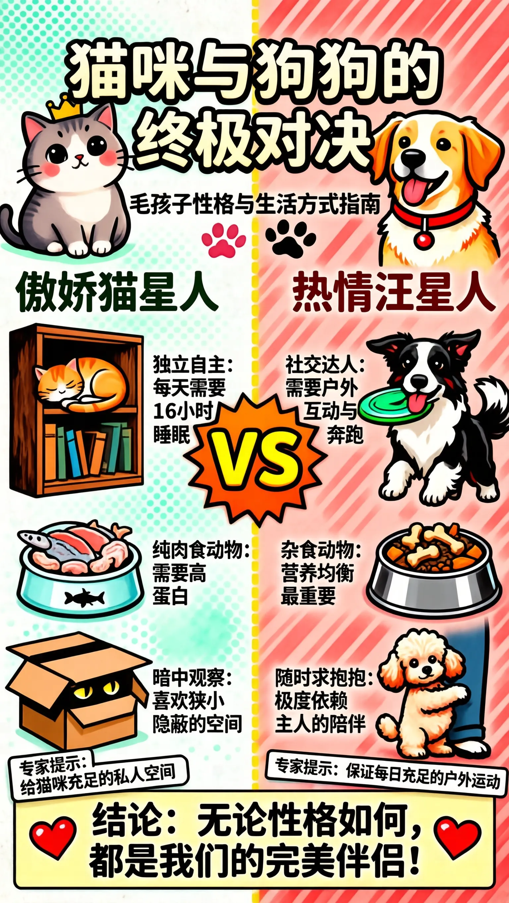 | 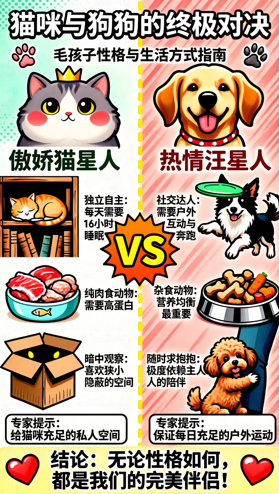 | 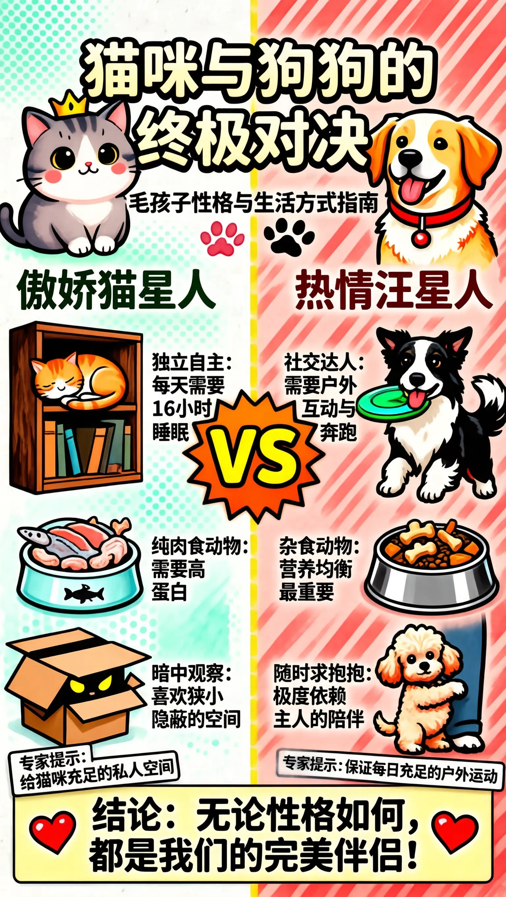 | 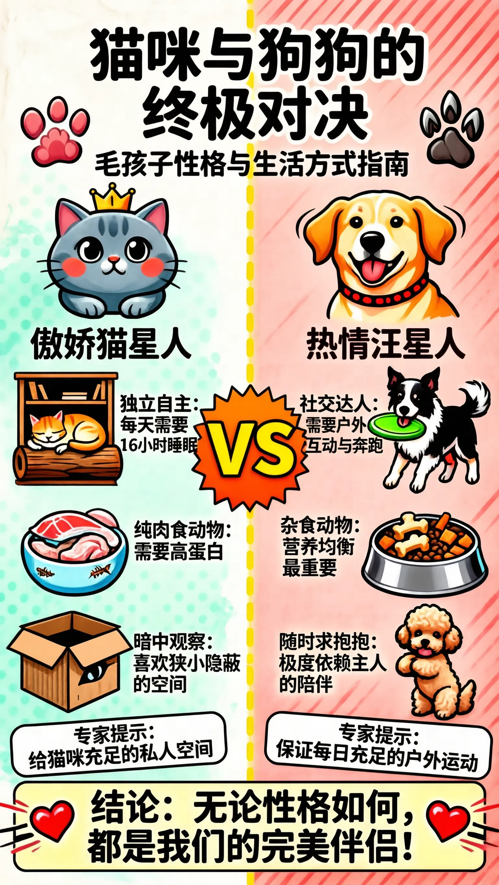 | 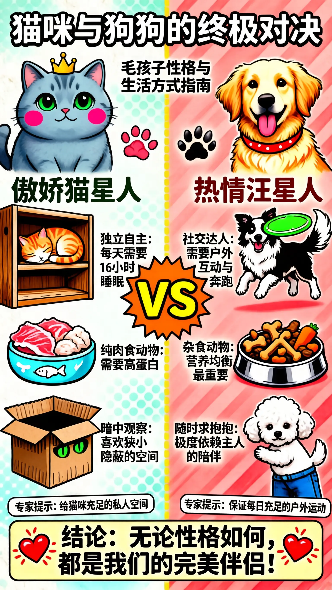 |
